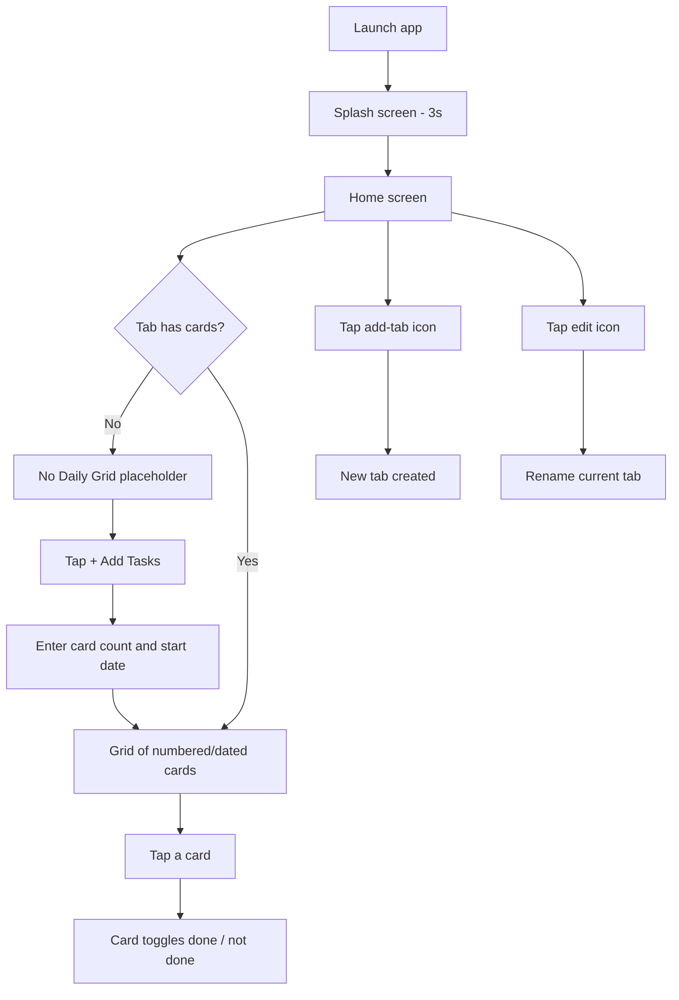

# DailyGrid

A minimal Flutter app for tracking recurring, dated tasks as a grid of numbered cards, organized into user-defined tabs. Each tab holds its own set of cards; tapping a card marks it done. Progress is saved locally and restored on the next launch.


---

## Overview

DailyGrid answers a narrow, specific need: tracking a fixed run of dated, numbered items — for example "10 sessions starting today" or "30 days of a routine starting on a given date" — without needing individual to-do entries for each one. Instead of typing out each task, the user tells the app how many cards to generate and a starting date; the app generates one card per day and lays them out in a scrollable grid, where tapping a card toggles it done.

Multiple independent grids can be kept side by side as tabs (e.g. separate tabs for separate routines), and each tab's cards persist across app restarts via local device storage.

## Key Features

Based on what is implemented in `lib/homescreen.dart` and `lib/splash_screen.dart`:

- **Splash screen** — displays a full-screen branded image for 3 seconds before navigating to the home screen.
- **Tabbed grids** — an app starts with one default tab; additional tabs ("grids") can be added, renamed, or deleted (deletion is only available once more than one tab exists).
- **Bulk task generation** — a dialog collects a card count and a start date (`dd/MM/yyyy`, defaults to today if left blank); the app generates that many numbered cards, each dated one day after the previous.
- **Date validation** — an invalid date entry shows a `SnackBar` error instead of crashing or generating bad data.
- **Toggleable card state** — tapping a card flips it between its number/date view and a "done" checkmark view.
- **Scroll shortcuts** — floating buttons jump the grid to its top or bottom.
- **Local persistence** — all tabs and their cards are serialized to JSON and saved with `shared_preferences`, and reloaded automatically on startup.
- **Empty state** — a tab with no cards shows a "No Daily Grid" placeholder instead of an empty grid.

## Application Preview

### Splash Screen


### Home — Empty State


### Adding Tasks


### Home — Populated Grid


### Tab Management
 

## Demo

### Demo Video

<!-- DEMO VIDEO: Replace this placeholder with the final demo GIF/video -->
> Add the application demo video here.

## Tech Stack

### Frontend
- Flutter
- Dart

### State Management
- Built-in `StatefulWidget` / `setState` — no external state management package (Provider, Bloc, Riverpod, etc.) is used in the provided source.

### Storage
- `shared_preferences` — tabs and cards are JSON-encoded and stored as a string list under a single key.

### Utilities
- `intl` — used for date formatting/parsing (`DateFormat`).

No backend, API, authentication, or database (beyond local `shared_preferences`) is present in the provided source.

## Architecture

The provided source is a flat, single-feature app rather than a layered architecture:

- **`main.dart`** — app entry point; wraps a `MaterialApp` and boots straight into `SplashScreen`.
- **`splash_screen.dart`** — a timed splash (`Future.delayed`, 3 seconds) that then pushes a replacement route to `Homescreen`.
- **`homescreen.dart`** — contains almost the entire app: the `Task` model, all UI (`AppBar`, `TabBar`/`TabBarView`, `GridView`, dialogs), the interaction logic (add/rename/delete tab, generate tasks, toggle done), and the persistence calls (`saveTasks` / `loadTasks`) all live in this one `StatefulWidget`.

There is no separate widgets/, models/, services/, or repositories/ layering in the code as provided — the `Task` model is the only extracted class, defined at the top of `homescreen.dart`. This is a straightforward, UI-driven structure appropriate for the app's current scope rather than a Clean Architecture or MVVM setup.

```text
lib/
├── main.dart            # App entry point, launches SplashScreen
├── splash_screen.dart   # 3-second branded splash, then navigates to Homescreen
└── homescreen.dart      # Task model + tab bar, grid UI, dialogs, and persistence
```

## User Flow



## Core Implementation Details

- **Task generation** — the "Add Tasks" dialog takes a card count and an optional start date; on confirm, the app builds a list of `Task` objects numbered `1..N`, each dated one day after the previous, replacing the current tab's task list.
- **Persistence format** — each tab is serialized as `{ name, tasks: [...] }` and the whole `tabbar` list is JSON-encoded per tab into a `List<String>` stored via `shared_preferences`; on load, this is decoded back into `Task` objects via `Task.fromJson`.
- **Tab lifecycle** — adding a tab rebuilds the `TabController` with the new tab count; deleting a tab does the same after removing the tab at the current index, and is only exposed when more than one tab exists.
- **Form validation** — tab name fields use a `Form`/`GlobalKey<FormState>` with a required-field validator; the task-count field enables its "OK" button only once a value is entered.
- **Error handling** — an unparsable start date is caught and surfaced via a `SnackBar` ("Invalid Date (dd/MM/yyyy)") instead of throwing.
- **UI feedback** — completed cards swap their number/date `ListTile` for a check icon, giving an at-a-glance done state per card.

## Installation & Setup

The screens in this repository were extracted from the provided source files; a `pubspec.yaml` was not part of what was supplied, so create/verify one with at least the dependencies below before running.

1. **Prerequisites**: Flutter SDK and Dart (bundled with Flutter) installed and on your `PATH`.
2. **Clone the repository**
   ```bash
   git clone <this-repository-url>
   cd <repository-folder>
   ```
3. **Ensure dependencies are declared** in `pubspec.yaml`:
   ```yaml
   dependencies:
     flutter:
       sdk: flutter
     intl: <version>
     shared_preferences: <version>
   ```
4. **Install dependencies**
   ```bash
   flutter pub get
   ```
5. **Provide the splash background asset** — `splash_screen.dart` loads `assets/images/background.png`; add this image and declare it under `flutter: assets:` in `pubspec.yaml`, or replace it with your own.
6. **Run the app**
   ```bash
   flutter run
   ```

## Configuration

No API keys, `.env` files, Firebase configuration, or backend URLs are used by the provided source — the app runs entirely on-device.

## Testing

No test files were included in the provided source. Testing coverage can be expanded in future iterations.

## Performance Considerations

- Cards are rendered with `GridView.builder`, which builds items lazily as they scroll into view rather than all at once.
- Persistence writes (`saveTasks`) are only triggered on explicit user actions (toggling a card, adding/renaming/deleting a tab, generating tasks), not on every rebuild.

## Security Considerations

The app stores only task numbers and dates locally via `shared_preferences`; it does not handle credentials, tokens, or personal data, and has no network layer to secure.

## Future Improvements

- Automated widget/unit tests
- Per-task editing (currently tasks are only bulk-generated or toggled, not individually edited)
- Reordering or deleting individual cards
- Reconciling the "DailyGrid" vs. "GridDaily" naming between the splash asset and the app bar
- CI/CD pipeline
- Accessibility pass (labels/contrast for the custom card UI)

## License

No license file was provided with the source, so none is stated here. Add a `LICENSE` file and reference it here once a license has been chosen.

## Author

Author information was not included in the provided source/context.
